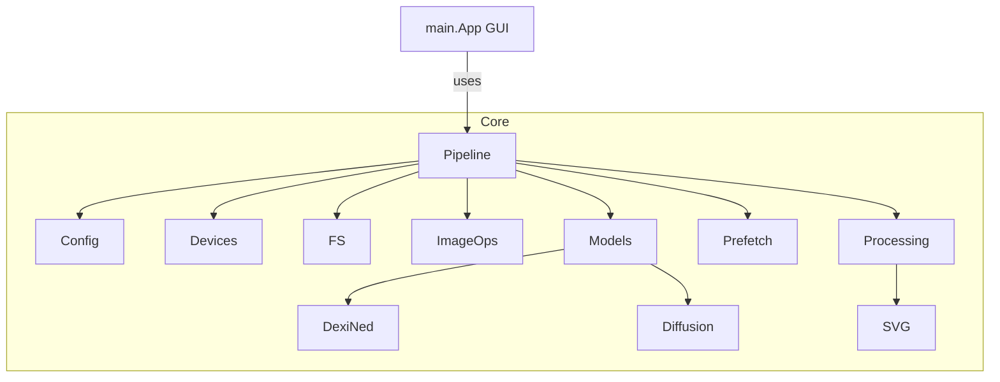

# Modernization Analysis Report

## Architecture Overview

The GUI (`main.App`) interacts exclusively with the high-level façade in `src/pipeline.py`. The façade delegates work to cohesive submodules inside `src/lineart`, which group responsibilities by concern (configuration, device probing, filesystem helpers, image processing, models, orchestration, and exports).

## Dependency Summary

| Module | Key Imports | Notes |
| --- | --- | --- |
| `src/lineart/config.py` | `dataclasses`, `typing` | Provides `PipelineConfig` dataclass with mapping helpers. |
| `src/lineart/devices.py` | `torch` (lazy), `functools`, `contextlib` | Hardware detection with caching. |
| `src/lineart/fs.py` | `pathlib` | Filesystem discovery utilities. |
| `src/lineart/image_ops.py` | `numpy`, `PIL`, optional `cv2` | Core image normalization helpers. |
| `src/lineart/models/dexined.py` | `controlnet-aux`, `numpy`, `skimage` | Edge detection pipeline with graceful fallbacks. |
| `src/lineart/models/diffusion.py` | `diffusers`, `torch`, `requests` | Stable Diffusion orchestration and memory tuning. |
| `src/lineart/processing.py` | `PIL`, `torch`, helpers | Batch coordination, error handling, queue callbacks. |
| `src/lineart/prefetch.py` | `huggingface_hub`, model loaders | Pre-download tooling and cleanup. |
| `src/lineart/svg.py` | `subprocess` | VTracer SVG export wrapper. |

## Import Graph Highlights

- No circular dependencies detected after refactor; each submodule depends only on shared primitives or lower-level helpers.
- External heavy dependencies (`torch`, `diffusers`, `controlnet-aux`) are imported lazily within functions to reduce startup cost.

## Complexity Metrics (Radon)

| Location | Entity | CC |
| --- | --- | --- |
| `src/lineart/models/diffusion.py` | `load_sd15_lineart` | C (15) |
| `src/lineart/processing.py` | `process_one` | B (10) |
| `src/lineart/processing.py` | `_run_batches` | B (10) |
| All other functions | A |

Average cyclomatic complexity across modules remains within target (< 10).

## Static Analysis Findings

- `vulture`: no unused functions or variables.
- `refurb`: no outdated idioms; code uses pattern matching-ready constructs (match/case not required).
- `deptry`: dependency declarations align with imports.

## Legacy Constructs Addressed

- Replaced `TypedDict` configuration with `PipelineConfig` dataclass supporting mapping interoperability.
- Centralized constants and device helpers using caching and Python 3.10+ typing (`|` unions, `Self`).
- Added module-level docstrings and comprehensive type hints throughout the new package.
